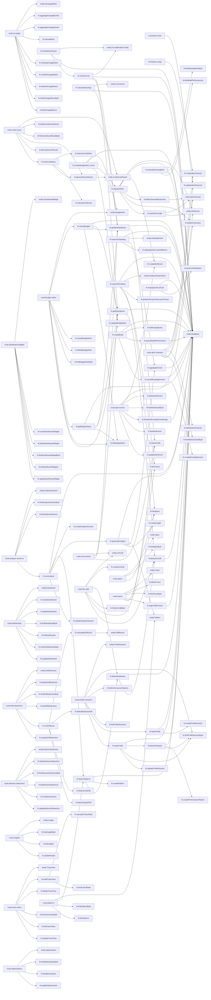

# Dependency Graph

Auto-generated by `scripts/generate-dep-graph.mjs`.

```mermaid
graph LR
  cmd:alerts-mute --> fn:updateAlertChannel
  cmd:alerts-setup --> fn:createAlertChannel
  fn:aggregateCosts --> entity:Database
  fn:buildTraceView --> fn:calculateTraceStats
  fn:buildTraceView --> fn:findCriticalPath
  fn:calculateDriftScore --> entity:DriftResult
  fn:calculateSavings --> entity:Conversion
  fn:calculateSavings --> entity:Database
  fn:calculateSavings --> fn:getMonthlySpend
  fn:checkBudget --> entity:Database
  fn:checkBudget --> fn:getDailySpend
  fn:checkBudget --> fn:getMonthlySpend
  fn:checkBudget --> fn:listBudgetAlerts
  fn:checkCircuit --> entity:CircuitBreakerConfig
  fn:checkCircuit --> entity:Database
  fn:checkCircuit --> fn:getDailySpend
  fn:checkCircuit --> fn:getMonthlySpend
  fn:createBudgetAlert_event --> entity:BudgetAlert
  fn:createBudgetAlert_event --> entity:Database
  fn:createBudgetAlert_event --> fn:dispatchAlert
  fn:createBudgetAlert_event --> fn:updateBudgetAlert
  fn:detectDuplicates --> entity:Database
  fn:detectDuplicates --> fn:queryLlmCall
  fn:detectHotspots --> entity:Database
  fn:detectHotspots --> fn:createPerformancePattern
  fn:detectHotspots --> fn:findProfileSessionById
  fn:detectPatterns --> entity:Database
  fn:detectPatterns --> fn:createPattern
  fn:detectPatterns --> fn:detectDuplicates
  fn:dispatchAlert --> entity:AlertEvent
  fn:dispatchAlert --> entity:Database
  fn:dispatchAlert --> fn:createAlertEvent
  fn:dispatchAlert --> fn:filterChannelsBySeverity
  fn:dispatchAlert --> fn:listAlertChannels
  fn:dispatchAlert --> fn:sendToProvider
  fn:evaluateRoutingRule --> entity:Database
  fn:evaluateRoutingRule --> fn:findRoutingRuleById
  fn:evaluateRoutingRule --> fn:listModelPerformances
  fn:exportToDatadog --> entity:Database
  fn:exportToDatadog --> entity:DatadogClient
  fn:exportToDatadog --> fn:aggregateCosts
  fn:exportToDatadog --> fn:datadogClient.submitMetrics
  fn:exportToGrafana --> entity:Database
  fn:exportToGrafana --> entity:GrafanaTempoClient
  fn:exportToGrafana --> fn:grafanaTempoClient.pushTraces
  fn:exportToGrafana --> fn:listSpans
  fn:exportToGrafana --> fn:listTraces
  fn:filterChannelsBySeverity --> entity:AlertChannel
  fn:findAlertEventsByTimeRange --> entity:Database
  fn:generateInsights --> entity:Database
  fn:generateInsights --> entity:Pattern
  fn:generateInsights --> fn:aggregateCosts
  fn:generateInsights --> fn:createInsight
  fn:generateScanReport --> entity:CodeScanResult
  fn:getBudgetStatus --> entity:Database
  fn:getBudgetStatus --> fn:getDailySpend
  fn:getBudgetStatus --> fn:getMonthlySpend
  fn:getBudgetStatus --> fn:listBudgetAlerts
  fn:getDailySpend --> entity:Database
  fn:getDailySpend --> fn:queryLlmCall
  fn:getMonthlySpend --> entity:Database
  fn:getMonthlySpend --> fn:listLlmCalls
  fn:ingestOtlpTraces --> entity:Database
  fn:mapSpanToLlmCall --> entity:Database
  fn:mapSpanToLlmCall --> fn:parseLlmAttributes
  fn:queryLlmCall --> entity:Database
  fn:queryModelPerformance --> entity:Database
  fn:recordRoutingDecision --> entity:Database
  fn:recordRoutingDecision --> fn:createRoutingDecision
  fn:routeModel --> entity:Database
  fn:routeModel --> fn:listRoutingRules
  fn:routeModel --> fn:queryModelPerformance
  fn:routeModel --> fn:recordRoutingDecision
  fn:runAnalysis --> entity:Database
  fn:runAnalysis --> fn:createAnalyzeSession
  fn:runAnalysis --> fn:detectPatterns
  fn:runAnalysis --> fn:generateInsights
  fn:runAnalysis --> fn:updateAnalyzeSession
  fn:runDriftScan --> fn:calculateDriftScore
  fn:runDriftScan --> fn:detectBehaviorDrift
  fn:runDriftScan --> fn:detectCostDrift
  fn:runDriftScan --> fn:detectOutputDrift
  fn:scanCodebase --> fn:detectLlmCallSites
  fn:scanCodebase --> fn:estimateCallCosts
  fn:scanCodebase --> fn:generateScanReport
  fn:sendToProvider --> entity:AlertChannel
  fn:sendToProvider --> entity:AlertEvent
  fn:shouldAutoPause --> entity:CircuitBreakerConfig
  fn:shouldAutoPause --> entity:Database
  fn:shouldAutoPause --> fn:checkCircuit
  fn:startProfile --> entity:Database
  fn:startProfile --> fn:createProfileSession
  fn:stopProfile --> entity:Database
  fn:stopProfile --> fn:detectHotspots
  fn:stopProfile --> fn:findProfileSessionById
  fn:stopProfile --> fn:updateProfileSession
  route:ai-usage --> entity:AiUsageMetric
  route:ai-usage --> fn:aggregateUsageByTool
  route:ai-usage --> fn:aggregateUsageByUser
  route:ai-usage --> fn:calculateRoi
  route:ai-usage --> fn:calculateUsageRank
  route:ai-usage --> fn:createAiUsageMetric
  route:ai-usage --> fn:deleteAiUsageMetric
  route:ai-usage --> fn:findAiUsageMetricById
  route:ai-usage --> fn:listAiUsageMetrics
  route:alert-channels --> entity:AlertChannel
  route:alert-channels --> fn:createAlertChannel
  route:alert-channels --> fn:deleteAlertChannel
  route:alert-channels --> fn:findAlertChannelById
  route:alert-channels --> fn:listAlertChannels
  route:alert-channels --> fn:updateAlertChannel
  route:alert-events --> entity:AlertEvent
  route:alert-events --> fn:createAlertEvent
  route:alert-events --> fn:deleteAlertEvent
  route:alert-events --> fn:findAlertEventById
  route:alert-events --> fn:findAlertEventsByTimeRange
  route:alert-events --> fn:listAlertEvents
  route:alert-events --> fn:updateAlertEvent
  route:analyze-sessions --> entity:AnalyzeSession
  route:analyze-sessions --> fn:findAnalyzeSessionById
  route:analyze-sessions --> fn:listAnalyzeSessions
  route:analyze-sessions --> fn:runAnalysis
  route:budget-alerts --> entity:BudgetAlert
  route:budget-alerts --> fn:checkBudget
  route:budget-alerts --> fn:createBudgetAlert
  route:budget-alerts --> fn:deleteBudgetAlert
  route:budget-alerts --> fn:findBudgetAlertById
  route:budget-alerts --> fn:getBudgetStatus
  route:budget-alerts --> fn:listBudgetAlerts
  route:budget-alerts --> fn:updateBudgetAlert
  route:code-scans --> entity:CodeScanResult
  route:code-scans --> fn:deleteCodeScanResult
  route:code-scans --> fn:findCodeScanResultById
  route:code-scans --> fn:generateScanReport
  route:code-scans --> fn:listCodeScanResults
  route:code-scans --> fn:scanCodebase
  route:cost-events --> entity:LlmCall
  route:cost-events --> fn:getDailySpend
  route:cost-events --> fn:getMonthlySpend
  route:cost-events --> fn:listLlmCalls
  route:dashboard-widgets --> entity:DashboardWidget
  route:dashboard-widgets --> fn:createDashboardWidget
  route:dashboard-widgets --> fn:deleteDashboardWidget
  route:dashboard-widgets --> fn:findDashboardWidgetById
  route:dashboard-widgets --> fn:listDashboardWidgets
  route:dashboard-widgets --> fn:updateDashboardWidget
  route:dashboards --> entity:Dashboard
  route:dashboards --> fn:createDashboard
  route:dashboards --> fn:deleteDashboard
  route:dashboards --> fn:findDashboardById
  route:dashboards --> fn:listDashboards
  route:dashboards --> fn:renderDashboardData
  route:dashboards --> fn:updateDashboard
  route:delusion-detections --> entity:DelusionDetection
  route:delusion-detections --> fn:deleteDelusionDetection
  route:delusion-detections --> fn:findDelusionDetectionById
  route:delusion-detections --> fn:listDelusionDetections
  route:delusion-detections --> fn:runDelusionScan
  route:delusion-detections --> fn:updateDelusionDetection
  route:drift-detections --> entity:DriftDetection
  route:drift-detections --> fn:deleteDriftDetection
  route:drift-detections --> fn:findDriftDetectionById
  route:drift-detections --> fn:listDriftDetections
  route:drift-detections --> fn:runDriftScan
  route:drift-detections --> fn:updateDriftDetection
  route:insights --> entity:Insight
  route:insights --> fn:findInsightById
  route:insights --> fn:listInsights
  route:insights --> fn:updateInsight
  route:llm-calls --> entity:LlmCall
  route:llm-calls --> fn:createLlmCall
  route:llm-calls --> fn:detectDuplicates
  route:llm-calls --> fn:findLlmCallById
  route:llm-calls --> fn:listLlmCalls
  route:llm-calls --> fn:queryLlmCall
  route:optimizations --> entity:Optimization
  route:optimizations --> fn:findOptimizationById
  route:optimizations --> fn:listOptimizations
  route:optimizations --> fn:updateOptimization
  route:patterns --> entity:Pattern
  route:patterns --> fn:detectPatterns
  route:patterns --> fn:findPatternById
  route:patterns --> fn:listPatterns
  route:profile-sessions --> entity:ProfileSession
  route:profile-sessions --> fn:findProfileSessionById
  route:profile-sessions --> fn:listPerformancePatterns
  route:profile-sessions --> fn:listProfileSessions
  route:profile-sessions --> fn:startProfile
  route:profile-sessions --> fn:stopProfile
  route:spans --> entity:Span
  route:spans --> fn:findSpanById
  route:spans --> fn:listSpans
  route:trace-views --> entity:TraceView
  route:trace-views --> fn:buildTraceView
  route:trace-views --> fn:deleteTraceView
  route:trace-views --> fn:findTraceViewById
  route:trace-views --> fn:listTraceViews
  route:trace-views --> fn:updateTraceView
  route:traces --> entity:Trace
  route:traces --> fn:deleteTrace
  route:traces --> fn:findTraceById
  route:traces --> fn:ingestOtlpTraces
  route:traces --> fn:listSpans
  route:traces --> fn:listTraces
```
