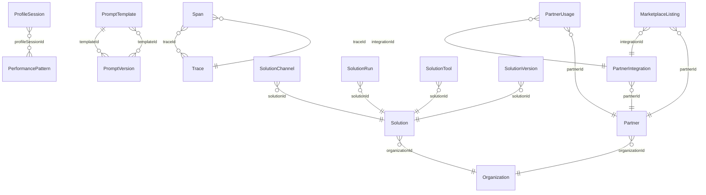

<!-- @generated by flusk-lang — DO NOT EDIT -->

# Entity Relations

```mermaid
erDiagram
  MarketplaceListing }o--|| Partner : "partnerId"
  MarketplaceListing }o--|| PartnerIntegration : "integrationId"
  PartnerIntegration }o--|| Partner : "partnerId"
  PartnerUsage }o--|| Partner : "partnerId"
  PartnerUsage }o--|| PartnerIntegration : "integrationId"
  Partner }o--|| Organization : "organizationId"
  ProfileSession }o--o{ PerformancePattern : "profileSessionId"
  PromptTemplate }o--o{ PromptVersion : "templateId"
  PromptVersion }o--|| PromptTemplate : "templateId"
  SolutionChannel }o--|| Solution : "solutionId"
  SolutionRun }o--|| Solution : "solutionId"
  SolutionTool }o--|| Solution : "solutionId"
  SolutionVersion }o--|| Solution : "solutionId"
  Solution }o--|| Organization : "organizationId"
  Span }o--|| Trace : "traceId"
  Trace }o--o{ Span : "traceId"
```
