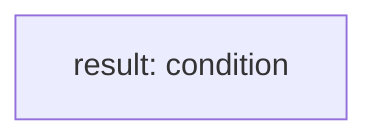

<!-- @generated by flusk-lang — DO NOT EDIT -->

# aggregateCosts

> Aggregate costs by model, time period, or agent

## Inputs

| Parameter | Type | Required |
|-----------|------|----------|
| db | Database | yes |
| groupBy | enum | yes |
| start | string | yes |
| end | string | yes |

## Steps

## Output

Type: `CostAggregation[]`
