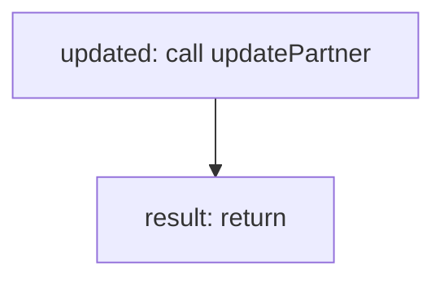

<!-- @generated by flusk-lang — DO NOT EDIT -->

# approvePartner

> Approves a pending partner and generates API key

## Inputs

| Parameter | Type | Required |
|-----------|------|----------|
| partnerId | string | yes |
| tier | string | yes |
| db | Database | yes |

## Steps

## Output

Type: `Partner`
