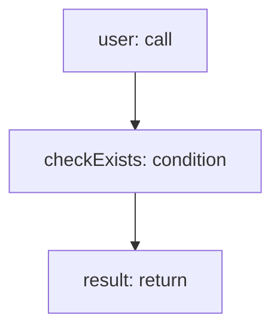

<!-- @generated by flusk-lang — DO NOT EDIT -->

# authenticateUser

> Authenticate user with email and password

## Inputs

| Parameter | Type | Required |
|-----------|------|----------|
| email | string | yes |
| password | string | yes |

## Steps

## Output

Type: `json`
