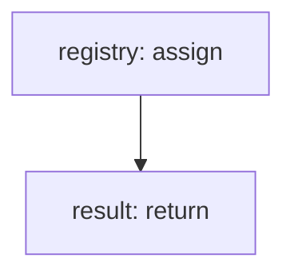

<!-- @generated by flusk-lang — DO NOT EDIT -->

# buildProviderRegistry

> Build a map of channel types to their send functions

## Steps

```mermaid
graph TD
  A[registry: assign]
  A --> B[result: return]
```

## Output

Type: `ProviderRegistry`
