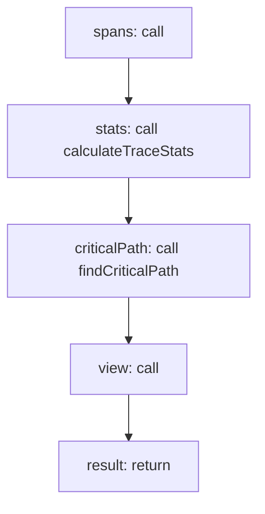

<!-- @generated by flusk-lang — DO NOT EDIT -->

# buildTraceView

> Assemble waterfall or flamegraph data from trace spans

## Inputs

| Parameter | Type | Required |
|-----------|------|----------|
| traceId | string | yes |
| viewType | string | yes |

## Steps

## Output

Type: `TraceViewData`
