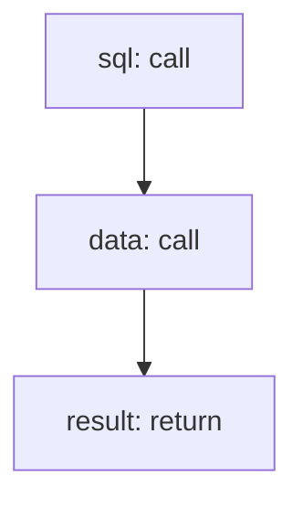

<!-- @generated by flusk-lang — DO NOT EDIT -->

# buildWidgetQuery

> Translate widget query config into SQL/aggregation and execute

## Inputs

| Parameter | Type | Required |
|-----------|------|----------|
| query | json | yes |
| timeRange | json | yes |

## Steps

## Output

Type: `json`
