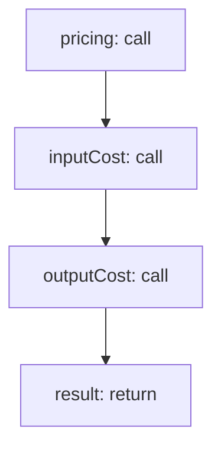

<!-- @generated by flusk-lang — DO NOT EDIT -->

# calculateCallCost

> Calculate cost from token counts and model pricing

## Inputs

| Parameter | Type | Required |
|-----------|------|----------|
| model | string | yes |
| provider | string | yes |
| promptTokens | integer | yes |
| completionTokens | integer | yes |

## Steps

## Output

Type: `CostResult`
