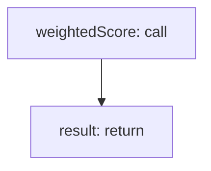

<!-- @generated by flusk-lang — DO NOT EDIT -->

# calculateDriftScore

> Compute overall drift score from multiple detection signals

## Inputs

| Parameter | Type | Required |
|-----------|------|----------|
| outputDrift | DriftResult | yes |
| costDrift | DriftResult | yes |
| behaviorDrift | DriftResult | yes |

## Steps

## Output

Type: `float`
