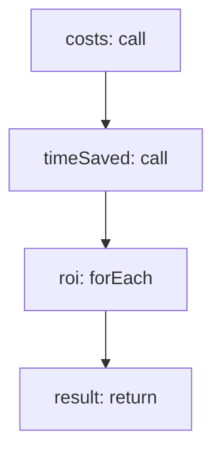

<!-- @generated by flusk-lang — DO NOT EDIT -->

# calculateRoi

> Estimate ROI from AI tool usage (cost of licenses vs productivity gains)

## Inputs

| Parameter | Type | Required |
|-----------|------|----------|
| timeRange | json | yes |

## Steps

## Output

Type: `json`
