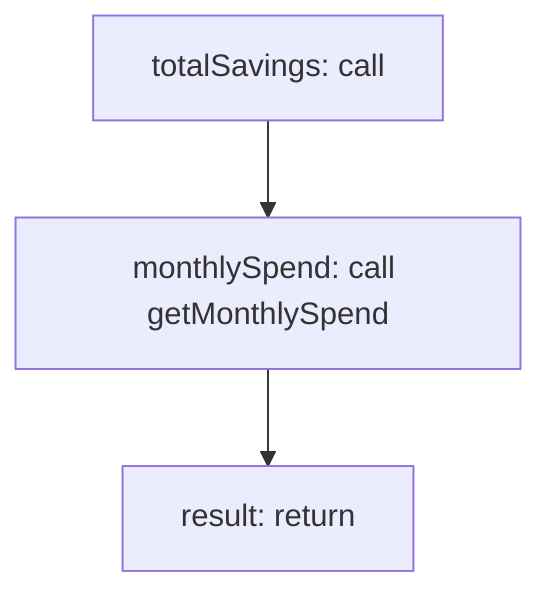

<!-- @generated by flusk-lang — DO NOT EDIT -->

# calculateSavings

> Project savings from applying optimizations

## Inputs

| Parameter | Type | Required |
|-----------|------|----------|
| db | Database | yes |
| optimizations | Conversion[] | yes |

## Steps

## Output

Type: `SavingsSummary`
