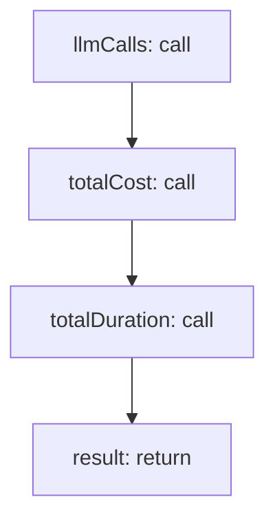

<!-- @generated by flusk-lang — DO NOT EDIT -->

# calculateTraceStats

> Aggregate cost, duration, and call count per trace

## Inputs

| Parameter | Type | Required |
|-----------|------|----------|
| traceId | string | yes |
| spans | json | yes |

## Steps

## Output

Type: `TraceStats`
