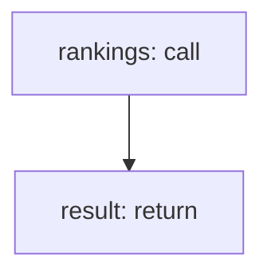

<!-- @generated by flusk-lang — DO NOT EDIT -->

# calculateUsageRank

> Rank users and teams by AI effectiveness

## Inputs

| Parameter | Type | Required |
|-----------|------|----------|
| timeRange | json | yes |
| metricType | string | yes |

## Steps

## Output

Type: `json`
