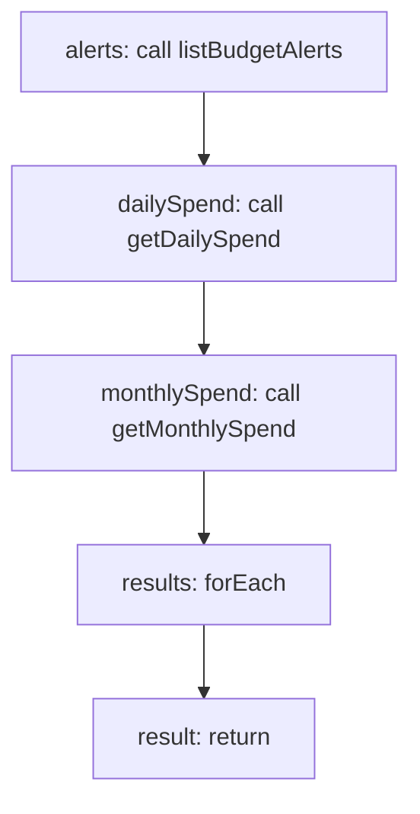

<!-- @generated by flusk-lang — DO NOT EDIT -->

# checkBudget

> Check if current spending exceeds any budget thresholds

## Inputs

| Parameter | Type | Required |
|-----------|------|----------|
| db | Database | yes |

## Steps

## Output

Type: `BudgetCheckResult[]`
