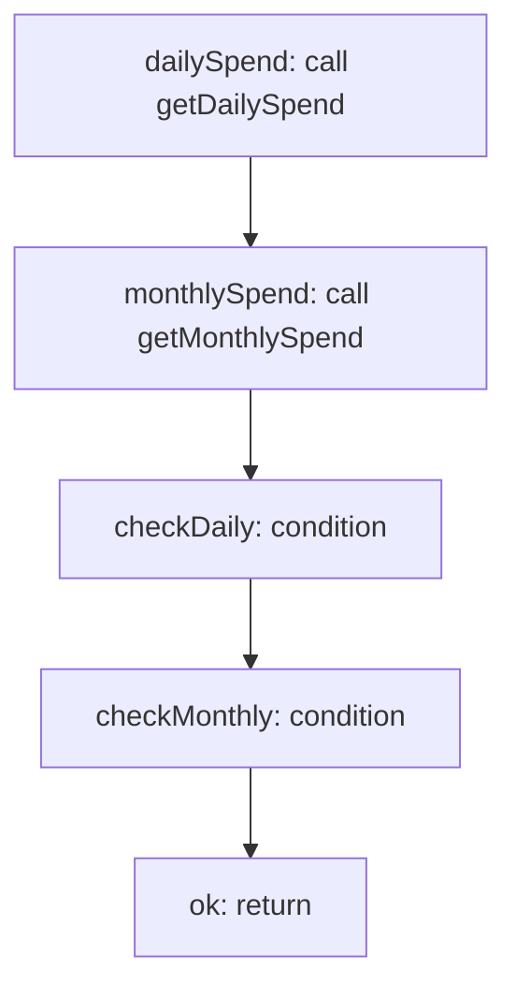

<!-- @generated by flusk-lang — DO NOT EDIT -->

# checkCircuit

> Check if spending exceeds circuit breaker thresholds

## Inputs

| Parameter | Type | Required |
|-----------|------|----------|
| db | Database | yes |
| config | CircuitBreakerConfig | yes |

## Steps

## Output

Type: `CircuitStatus`
