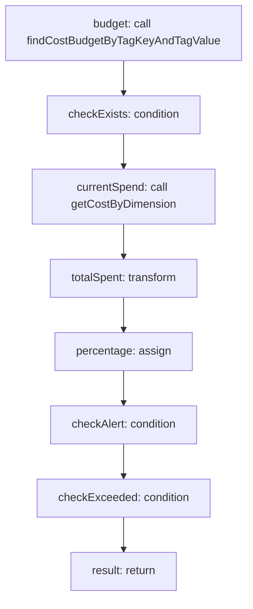

<!-- @generated by flusk-lang — DO NOT EDIT -->

# checkCostBudget

> Check if a tag's spending is within budget, alert if approaching/exceeded

## Inputs

| Parameter | Type | Required |
|-----------|------|----------|
| tagKey | string | yes |
| tagValue | string | yes |
| db | Database | yes |

## Steps

## Output

Type: `BudgetStatus`
