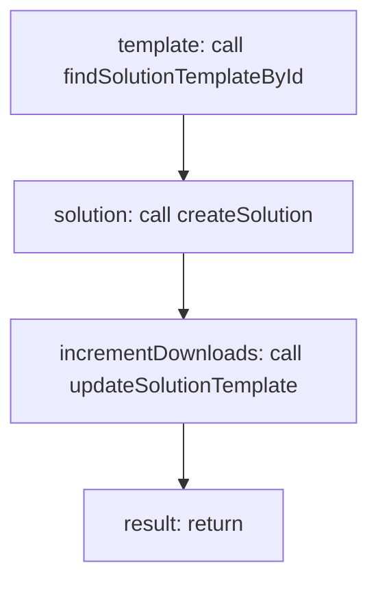

<!-- @generated by flusk-lang — DO NOT EDIT -->

# cloneSolutionFromTemplate

> Creates a new solution from a template

## Inputs

| Parameter | Type | Required |
|-----------|------|----------|
| templateId | string | yes |
| organizationId | string | yes |
| name | string | yes |
| db | Database | yes |

## Steps

## Output

Type: `Solution`
