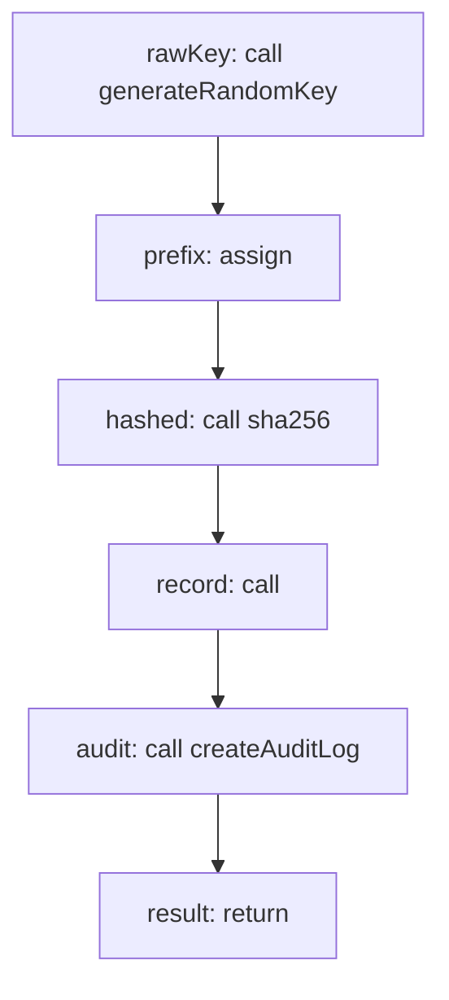

<!-- @generated by flusk-lang — DO NOT EDIT -->

# createApiKey

> Generate an API key, hash it, store the hash, return plaintext once

## Inputs

| Parameter | Type | Required |
|-----------|------|----------|
| organizationId | uuid | yes |
| userId | uuid | yes |
| name | string | yes |
| scopes | json | yes |
| expiresAt | date | yes |

## Steps

## Output

Type: `json`
