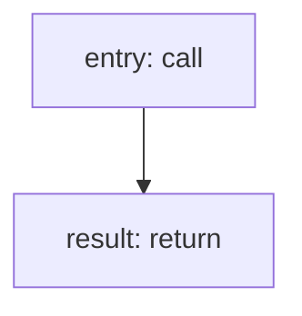

<!-- @generated by flusk-lang — DO NOT EDIT -->

# createAuditLog

> Record an immutable audit log entry

## Inputs

| Parameter | Type | Required |
|-----------|------|----------|
| organizationId | uuid | yes |
| userId | uuid | yes |
| action | string | yes |
| resource | string | yes |
| resourceId | string | yes |
| metadata | json | yes |
| ipAddress | string | yes |

## Steps

## Output

Type: `AuditLog`
