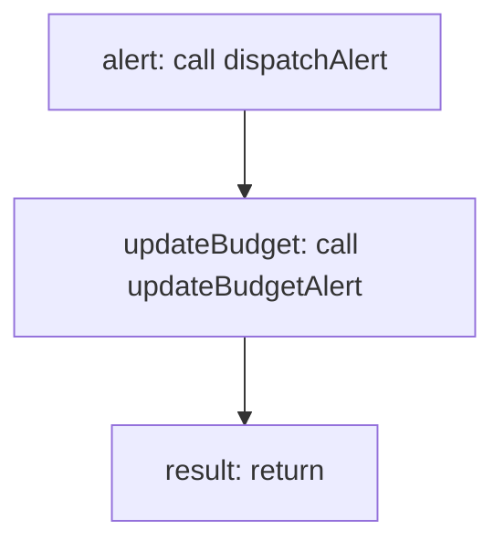

<!-- @generated by flusk-lang — DO NOT EDIT -->

# createBudgetAlertEvent

> Create an alert event when a budget is exceeded

## Inputs

| Parameter | Type | Required |
|-----------|------|----------|
| db | Database | yes |
| budgetAlert | BudgetAlert | yes |
| currentSpend | float | yes |

## Steps

## Output

Type: `AlertEvent`
