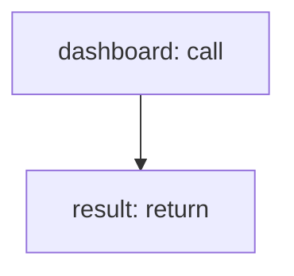

<!-- @generated by flusk-lang — DO NOT EDIT -->

# createDashboard

> Create a new dashboard with default widgets

## Inputs

| Parameter | Type | Required |
|-----------|------|----------|
| name | string | yes |
| description | string | yes |
| layout | json | yes |
| filters | json | yes |
| owner | string | yes |

## Steps

## Output

Type: `Dashboard`
