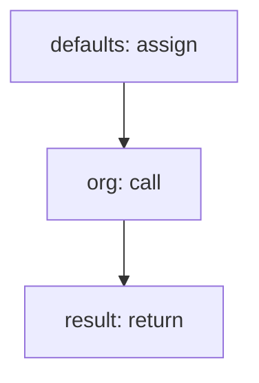

<!-- @generated by flusk-lang — DO NOT EDIT -->

# createOrganization

> Create a new organization with default plan limits

## Inputs

| Parameter | Type | Required |
|-----------|------|----------|
| name | string | yes |
| slug | string | yes |
| plan | string | yes |

## Steps

## Output

Type: `Organization`
