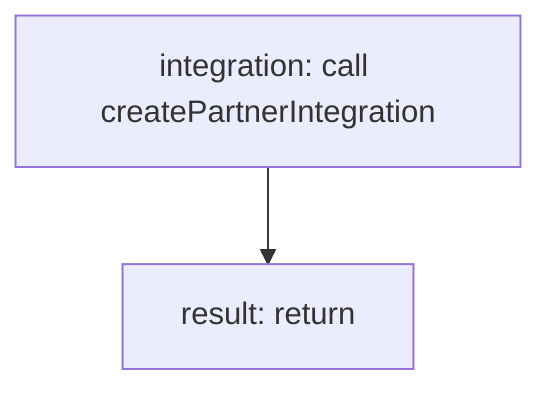

<!-- @generated by flusk-lang — DO NOT EDIT -->

# createPartnerIntegration

> Creates a new integration for a partner

## Inputs

| Parameter | Type | Required |
|-----------|------|----------|
| partnerId | string | yes |
| name | string | yes |
| type | string | yes |
| config | json | yes |
| endpointUrl | string | yes |
| documentation | string | yes |
| db | Database | yes |

## Steps

## Output

Type: `PartnerIntegration`
