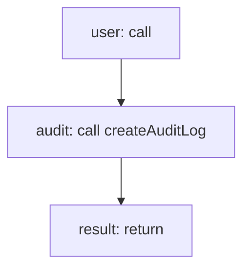

<!-- @generated by flusk-lang — DO NOT EDIT -->

# createUser

> Create a user within an organization

## Inputs

| Parameter | Type | Required |
|-----------|------|----------|
| organizationId | uuid | yes |
| email | string | yes |
| name | string | yes |
| role | string | yes |

## Steps

## Output

Type: `User`
