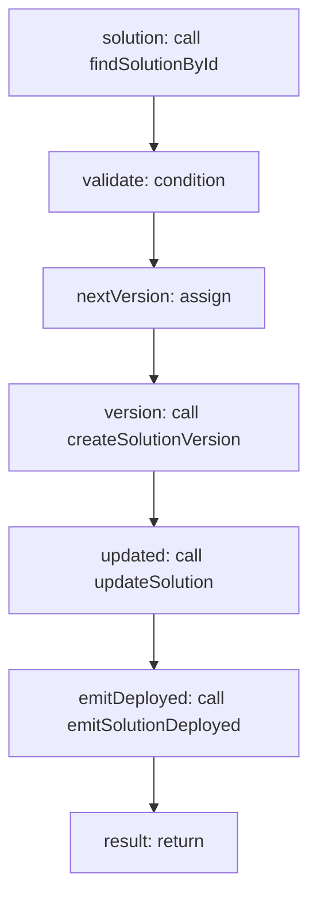

<!-- @generated by flusk-lang — DO NOT EDIT -->

# deploySolution

> Validates config, sets status to active, creates a new version

## Inputs

| Parameter | Type | Required |
|-----------|------|----------|
| solutionId | string | yes |
| changelog | string | yes |
| publishedBy | string | yes |
| db | Database | yes |

## Steps

## Output

Type: `Solution`
