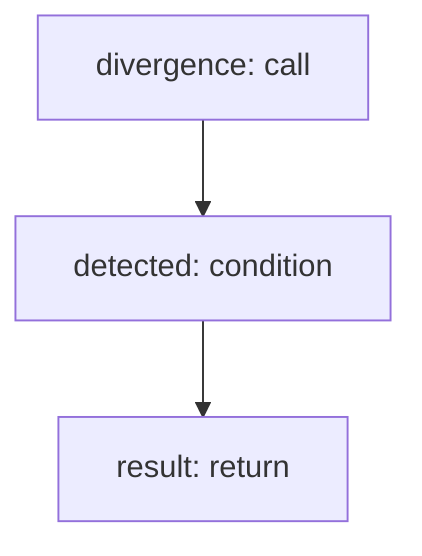

<!-- @generated by flusk-lang — DO NOT EDIT -->

# detectConfidenceMismatch

> Flag cases where model states high confidence but answer is wrong

## Inputs

| Parameter | Type | Required |
|-----------|------|----------|
| llmCallId | string | yes |
| statedConfidence | float | yes |
| actualAccuracy | float | yes |

## Steps

## Output

Type: `DelusionResult`
