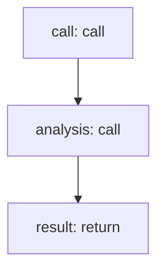

<!-- @generated by flusk-lang — DO NOT EDIT -->

# detectContradiction

> Find contradictions within a conversation or across outputs

## Inputs

| Parameter | Type | Required |
|-----------|------|----------|
| llmCallId | string | yes |
| conversationHistory | json | yes |

## Steps

## Output

Type: `DelusionResult`
