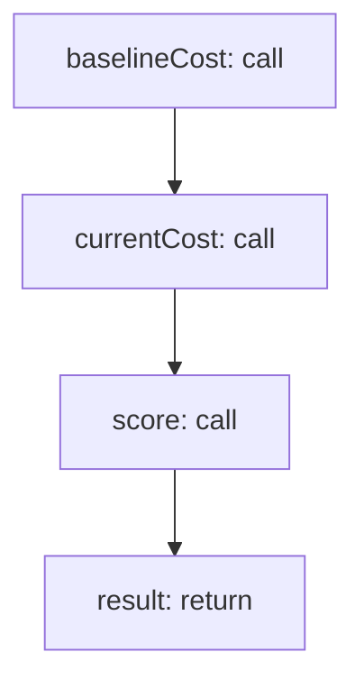

<!-- @generated by flusk-lang — DO NOT EDIT -->

# detectCostDrift

> Detect cost anomalies compared to a baseline period

## Inputs

| Parameter | Type | Required |
|-----------|------|----------|
| agentLabel | string | yes |
| baselinePeriod | json | yes |
| currentPeriod | json | yes |

## Steps

## Output

Type: `DriftResult`
