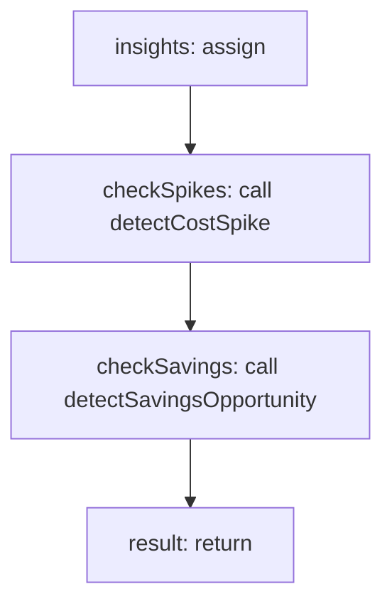

<!-- @generated by flusk-lang — DO NOT EDIT -->

# detectCostInsights

> Auto-detect cost insights — spikes, anomalies, savings opportunities

## Inputs

| Parameter | Type | Required |
|-----------|------|----------|
| byFeature | json | yes |
| byTeam | json | yes |
| byCustomer | json | yes |
| db | Database | yes |

## Steps

## Output

Type: `CostInsight[]`
