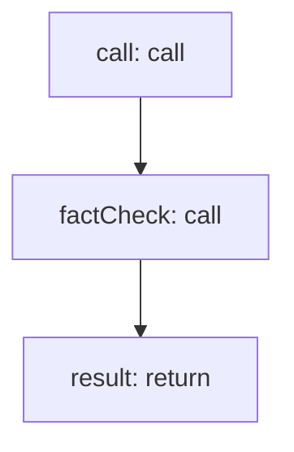

<!-- @generated by flusk-lang — DO NOT EDIT -->

# detectHallucination

> Check LLM output against known facts and documents for hallucinations

## Inputs

| Parameter | Type | Required |
|-----------|------|----------|
| llmCallId | string | yes |
| output | string | yes |
| context | json | yes |

## Steps

## Output

Type: `DelusionResult`
