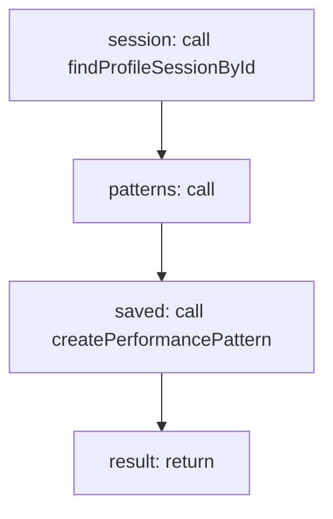

<!-- @generated by flusk-lang — DO NOT EDIT -->

# detectHotspots

> Find performance hotspots in profile data

## Inputs

| Parameter | Type | Required |
|-----------|------|----------|
| db | Database | yes |
| profileSessionId | string | yes |
| threshold | float | yes |

## Steps

## Output

Type: `PerformancePattern[]`
