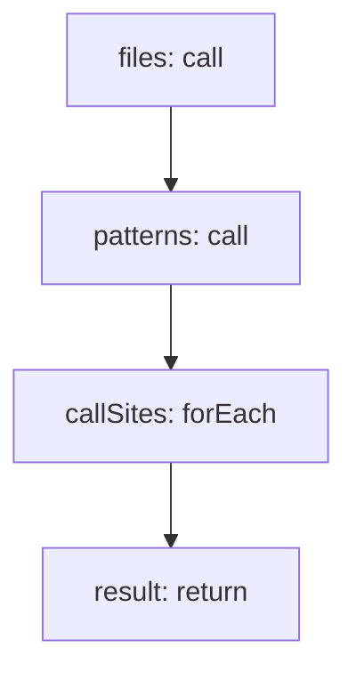

<!-- @generated by flusk-lang — DO NOT EDIT -->

# detectLlmCallSites

> Parse source files for provider SDK usage patterns

## Inputs

| Parameter | Type | Required |
|-----------|------|----------|
| projectPath | string | yes |

## Steps

## Output

Type: `json`
