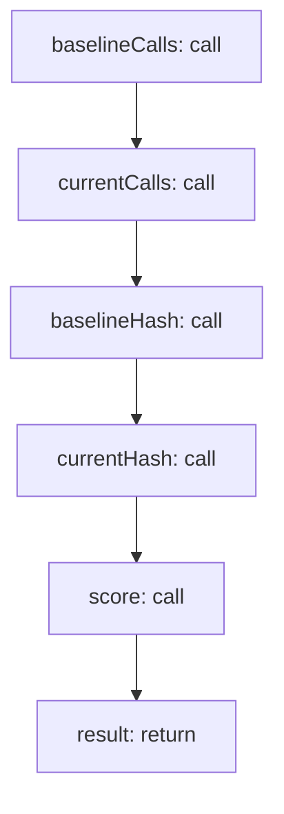

<!-- @generated by flusk-lang — DO NOT EDIT -->

# detectOutputDrift

> Compare agent outputs over two time periods to detect drift

## Inputs

| Parameter | Type | Required |
|-----------|------|----------|
| agentLabel | string | yes |
| baselinePeriod | json | yes |
| currentPeriod | json | yes |

## Steps

## Output

Type: `DriftResult`
