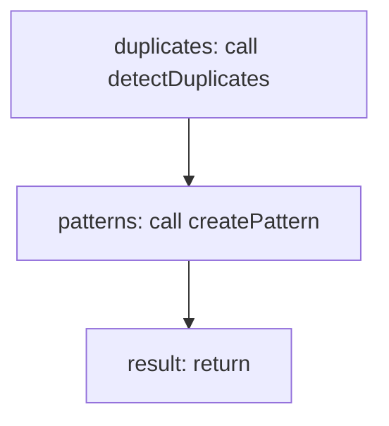

<!-- @generated by flusk-lang — DO NOT EDIT -->

# detectPatterns

> Find repetitive prompt patterns in LLM calls

## Inputs

| Parameter | Type | Required |
|-----------|------|----------|
| db | Database | yes |
| start | string | yes |
| end | string | yes |
| minOccurrences | integer | yes |

## Steps

## Output

Type: `Pattern[]`
