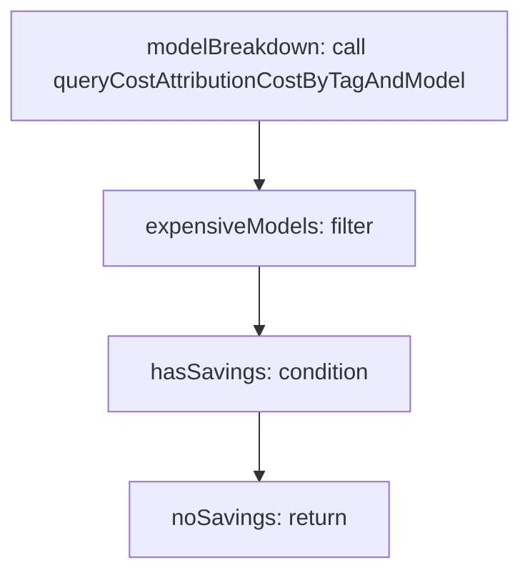

<!-- @generated by flusk-lang — DO NOT EDIT -->

# detectSavingsOpportunity

> Detect potential savings (e.g. expensive model used for simple tasks)

## Inputs

| Parameter | Type | Required |
|-----------|------|----------|
| item | json | yes |
| db | Database | yes |

## Steps

## Output

Type: `CostInsight`
