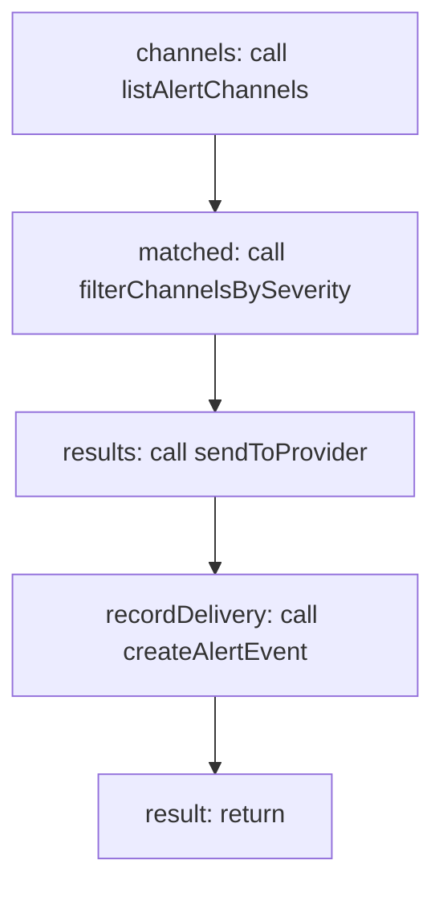

<!-- @generated by flusk-lang — DO NOT EDIT -->

# dispatchAlert

> Send alert to all matching channels and record delivery

## Inputs

| Parameter | Type | Required |
|-----------|------|----------|
| alert | AlertEvent | yes |
| db | Database | yes |

## Steps

## Output

Type: `DispatchResult[]`
