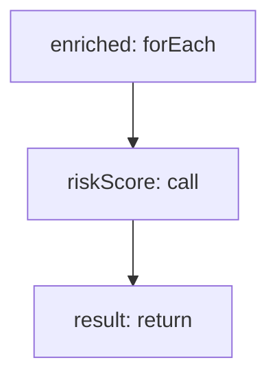

<!-- @generated by flusk-lang — DO NOT EDIT -->

# estimateCallCosts

> Estimate costs based on detected call patterns and usage frequency

## Inputs

| Parameter | Type | Required |
|-----------|------|----------|
| callSites | json | yes |

## Steps

## Output

Type: `json`
