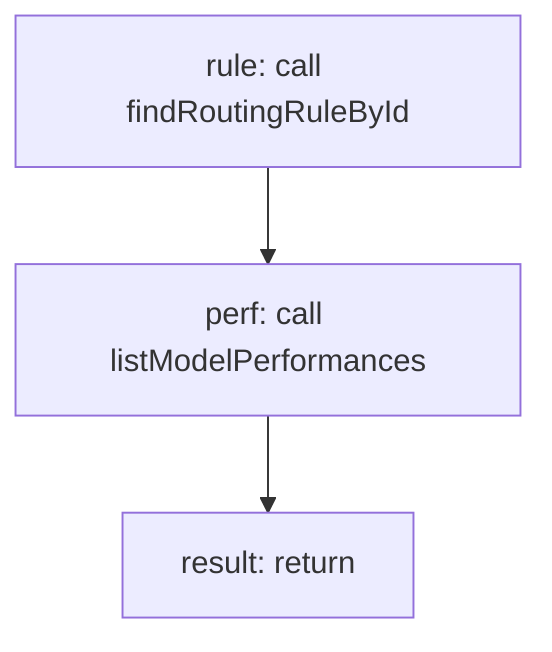

<!-- @generated by flusk-lang — DO NOT EDIT -->

# evaluateRoutingRule

> Check if a model meets quality threshold for a routing rule

## Inputs

| Parameter | Type | Required |
|-----------|------|----------|
| db | Database | yes |
| ruleId | string | yes |
| model | string | yes |
| promptCategory | string | yes |

## Steps

## Output

Type: `boolean`
