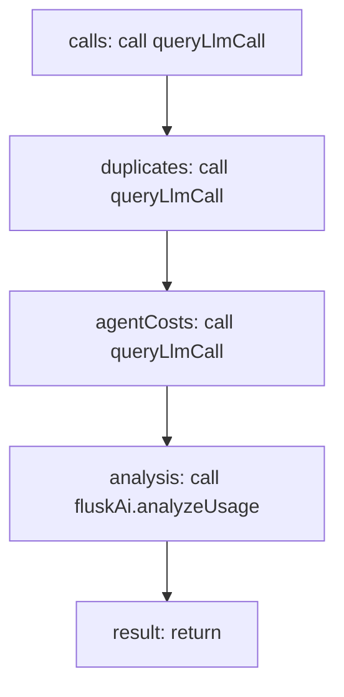

<!-- @generated by flusk-lang — DO NOT EDIT -->

# explainWithAi

> Loads recent LLM calls, costs, and patterns, sends to AI for analysis, returns actionable insights

## Inputs

| Parameter | Type | Required |
|-----------|------|----------|
| organizationId | string | yes |
| from | string | yes |
| to | string | yes |
| db | Database | yes |

## Steps

## Output

Type: `json`

## Error Handling

- **AiAnalysisError**: log-and-continue
