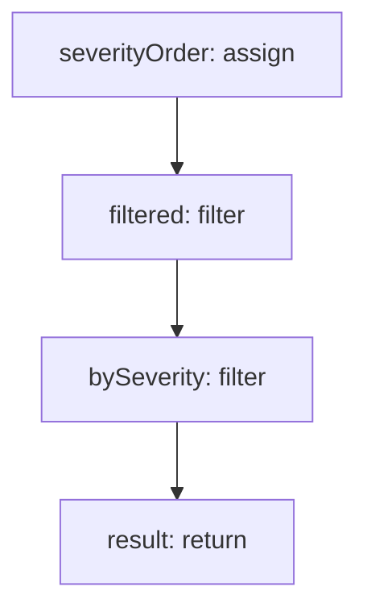

<!-- @generated by flusk-lang — DO NOT EDIT -->

# filterChannelsBySeverity

> Filter alert channels that match the given severity level

## Inputs

| Parameter | Type | Required |
|-----------|------|----------|
| channels | AlertChannel[] | yes |
| severity | string | yes |

## Steps

## Output

Type: `AlertChannel[]`
