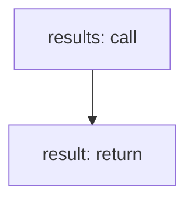

<!-- @generated by flusk-lang — DO NOT EDIT -->

# findAlertEventsByTimeRange

> Find alert events within a given time range

## Inputs

| Parameter | Type | Required |
|-----------|------|----------|
| startTime | string | yes |
| endTime | string | yes |
| db | Database | yes |

## Steps

## Output

Type: `AlertEvent[]`
