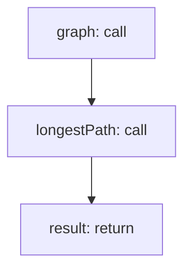

<!-- @generated by flusk-lang — DO NOT EDIT -->

# findCriticalPath

> Identify the critical path in a trace (longest sequential chain)

## Inputs

| Parameter | Type | Required |
|-----------|------|----------|
| spans | json | yes |

## Steps

## Output

Type: `json`
