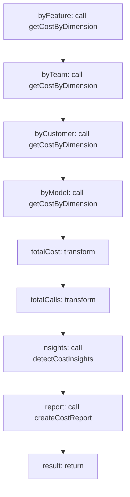

<!-- @generated by flusk-lang — DO NOT EDIT -->

# generateCostReport

> Generate a comprehensive cost attribution report for a period

## Inputs

| Parameter | Type | Required |
|-----------|------|----------|
| reportType | string | yes |
| from | string | yes |
| to | string | yes |
| format | string | yes |
| db | Database | yes |

## Steps

## Output

Type: `CostReport`
