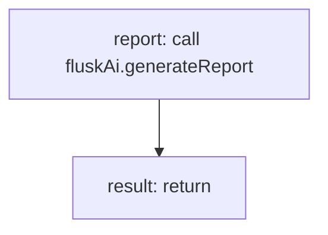

<!-- @generated by flusk-lang — DO NOT EDIT -->

# generateExplainReport

> Formats AI analysis into a structured report

## Inputs

| Parameter | Type | Required |
|-----------|------|----------|
| analysisData | json | yes |
| organizationId | string | yes |
| db | Database | yes |

## Steps

## Output

Type: `json`
