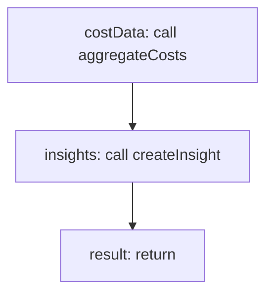

<!-- @generated by flusk-lang — DO NOT EDIT -->

# generateInsights

> Generate AI-powered optimization suggestions from detected patterns

## Inputs

| Parameter | Type | Required |
|-----------|------|----------|
| db | Database | yes |
| patterns | Pattern[] | yes |
| analyzeSessionId | string | yes |

## Steps

## Output

Type: `Insight[]`
