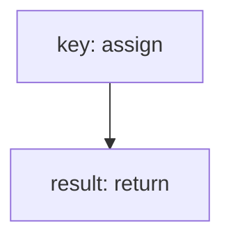

<!-- @generated by flusk-lang — DO NOT EDIT -->

# generateRandomKey

> Generate a cryptographically random key string

## Inputs

| Parameter | Type | Required |
|-----------|------|----------|
| length | number | yes |

## Steps

## Output

Type: `string`
