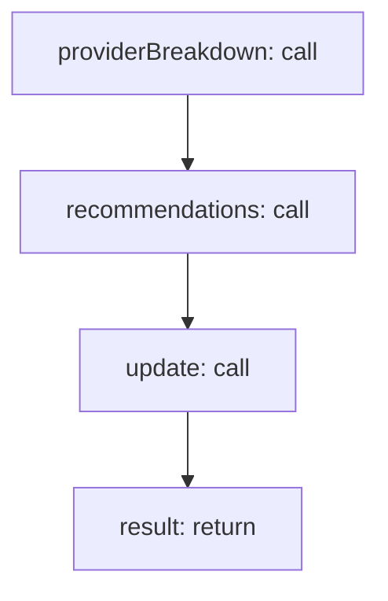

<!-- @generated by flusk-lang — DO NOT EDIT -->

# generateScanReport

> Produce summary report from code scan results

## Inputs

| Parameter | Type | Required |
|-----------|------|----------|
| scanResult | CodeScanResult | yes |

## Steps

## Output

Type: `json`
