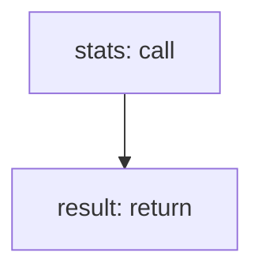

<!-- @generated by flusk-lang — DO NOT EDIT -->

# getAnalyticsOverview

> Aggregate overview — total cost, call count, avg latency, error rate, active models

## Inputs

| Parameter | Type | Required |
|-----------|------|----------|
| organizationId | uuid | yes |
| start | string | yes |
| end | string | yes |

## Steps

## Output

Type: `json`
