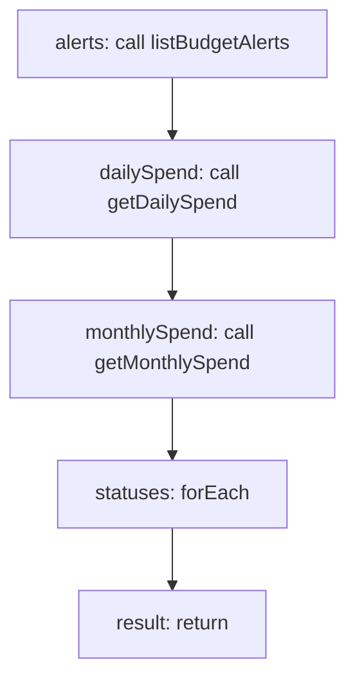

<!-- @generated by flusk-lang — DO NOT EDIT -->

# getBudgetStatus

> Get current spend vs limits summary for all budgets

## Inputs

| Parameter | Type | Required |
|-----------|------|----------|
| db | Database | yes |

## Steps

## Output

Type: `BudgetStatus[]`
